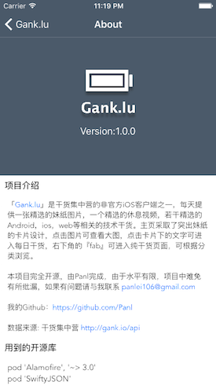
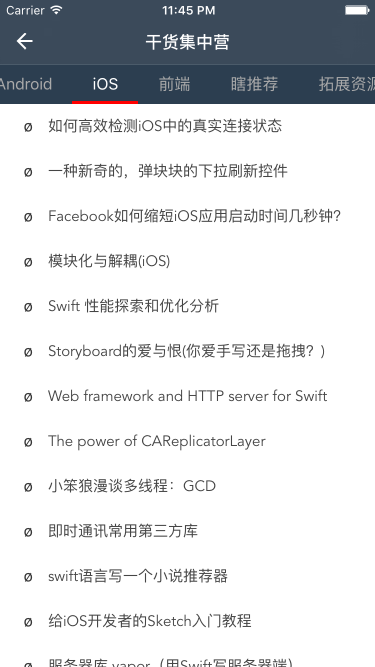

# Gank.lu
[中文版](README.md)
> **gank.io client for iOS**  
> This project recorded the process of learning iOS development  
> follow [Kevin's](https://github.com/kevinzhow) video guide -> [iOS With Girlfriend](http://www.bilibili.com/video/av2953140/)

- I also develop the client for Android,please click [Gank.io](https://github.com/Panl/Gank.io)  

#### screenshots

#### Preparation
- Learn Swift 2.1 syntax
- Learn how to use Xcode
- Learn basic flow for ios development  

#### Stage 1
- learn the usages of UITableView, NavigationController & MainStoryBoard (2016.1.3)
- custom UITableViewCell (2016.1.7)
- install CocoaPods & study to use it, use [Alamofire](https://github.com/Alamofire/Alamofire) to handle network requests (2016.1.9)
- use [SwiftyJSON](https://github.com/SwiftyJSON/SwiftyJSON) to parse json data, use [Kingfisher](https://github.com/onevcat/Kingfisher) to display image. (2016.2.3)

#### Stage 2
- use [MJRefresh](https://github.com/CoderMJLee/MJRefresh) to add the function of 'pull to refresh' & 'pull to load more' (2016.2.15)
- use [MBProgressHUD](https://github.com/jdg/MBProgressHUD) to display dialog for Long-Running Operations (2016.2.18)
- use **SFSafariViewController** display webview (2016.2.19)

#### Stage 3
- use [AFDateHelper](https://github.com/melvitax/AFDateHelper) to handle date (2016.2.26)
- use [PagingMenuController](https://github.com/kitasuke/PagingMenuController) to realize viewPager's effect on Android. (2016.2.26)
- combine UIScrollView with UIImageView to zoom picture (2016.2.26)

The project for learning Swift and iOS development is fundamentally completed, As a beginner, I need to learn more, and this project must have fallacy, please remind me by email or issues

**I will keep maintaining this project, for further study, I will add animations for this project. please pay attention to this project.**

------

#### Feb 28, CHANGELOG
- remove unused code
- add .igonore to igonre pods dictionary

#### Aug 20, CHANGELOG
- upgrade PagingMenuController code

#### Contributors
- [DianQK](https://github.com/DianQK)
